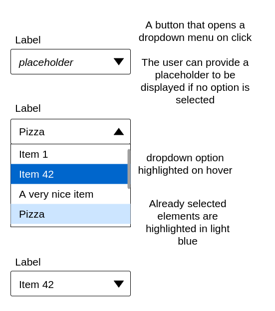
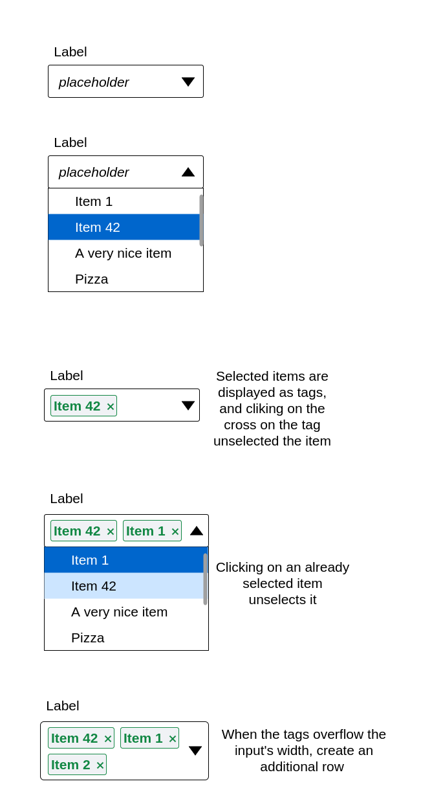
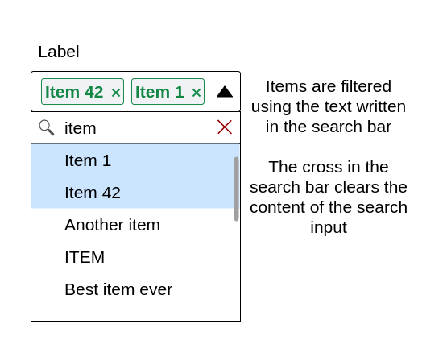

# frontend-interview

We are going to create a smart multi-select component.

In real life, data would be served by an API. For the sake of the exercise, we will mock the server with [getData](./src/api.ts).

Here are some rules to follow:

- Frameworks and libraries are tolerated as long as they do not help proving the features requested by the exercise.
- ES6 features should be used where appropriate.
- React functional components only, no classes.
- Cross-browser compatibility is not required for this exercise. You can specify which browser we should view your work in.

In order to reach the target component, this exercise is split in 3 progressive steps. Feel free to create one commit per step in your final solution.

## Step 1: Simple select

Create a dropdown component to let users select one item from the list. You can insert your component in the `Root` component, and use `setSelectedItems` as a handler.

Feel free to change anything you need to in any of the provided files.

## Step 2: Multi-select

Let users select multiple items from the list. The items should be displayed as tags in the input.

## Step 3: Autocomplete

Sometimes, the lists of options can be very long. To make the user's life easier, we will add a search bar to the component. Whenever the user enters a string, the list of options will be filtered to match that string.

